- [BR28 lua_ui开发](#br28-lua_ui开发)
  - [1. ui控件增加lua属性](#1-ui控件增加lua属性)
  - [1.1. ui工具中增加luascript属性（以layout为例）](#11-ui工具中增加luascript属性以layout为例)
    - [1.1.1. 控件模板添加luascript属性](#111-控件模板添加luascript属性)
    - [1.1.2. 升级ui工程源文件](#112-升级ui工程源文件)
  - [1.2. BR28 SDK的对应控件添加lua属性（以layout为例）](#12-br28-sdk的对应控件添加lua属性以layout为例)
    - [1.2.1. lua属性结构定义](#121-lua属性结构定义)
    - [1.2.2. layout结构添加lua属性](#122-layout结构添加lua属性)
      - [1.2.2.1. 在控件初始化函数添加 lua onload 代码的调用](#1221-在控件初始化函数添加-lua-onload-代码的调用)
      - [1.2.2.2. 在控件 ontouch 事件回调函数添加 touch 事件的响应代码执行](#1222-在控件-ontouch-事件回调函数添加-touch-事件的响应代码执行)
  - [2. 使用lua脚本开发APP](#2-使用lua脚本开发app)
    - [2.1. lua数据类型](#21-lua数据类型)
    - [2.2. 常用的lua语法](#22-常用的lua语法)
    - [2.3. br28 lua库](#23-br28-lua库)
  - [3. 扩展lua库](#3-扩展lua库)
    - [3.1 SDK添加lua扩展接口和库代码](#31-sdk添加lua扩展接口和库代码)
      - [3.1.1 常用的lua CAPI](#311-常用的lua-capi)
      - [3.1.2 br28 SDK用C语言添加一个lua库](#312-br28-sdk用c语言添加一个lua库)
      - [3.1.3 br28 lua库结构](#313-br28-lua库结构)
      - [3.1.4 br28 gui库结构](#314-br28-gui库结构)
    - [3.2 模拟器添加lua扩展模拟接口](#32-模拟器添加lua扩展模拟接口)
  - [4. 使用lua模拟UI效果](#4-使用lua模拟ui效果)
    - [4.1 创建button控件](#41-创建button控件)
    - [4.2 编辑lua代码](#42-编辑lua代码)
    - [4.3 启动模拟器](#43-启动模拟器)
    - [4.4 小机运行验证](#44-小机运行验证)
  - [5 现有的lua接口](#5-现有的lua接口)
    - [5.1 GUI 库](#51-gui-库)
      - [5.1.1 函数接口介绍模板](#511-函数接口介绍模板)
      - [5.1.1 获取控件对象](#511-获取控件对象)
      - [5.1.2 页面切换](#512-页面切换)
      - [5.1.3 返回上一页](#513-返回上一页)
      - [5.1.4 检查上一层页面](#514-检查上一层页面)
# BR28 lua_ui开发

## 1. ui控件增加lua属性
&nbsp;&nbsp;&nbsp;&nbsp;br28 SDK的UI控件可添加使用脚本语言lua开发的方法，控件中添加lua属性后即可通过ui工具作为IDE进行lua脚本开发，实现在windows系统中开发br28项目APP的目的。<br>

&nbsp;&nbsp;&nbsp;&nbsp;注意：ui工具和SDK对应的控件属性要一致，如果SDK中对控件添加lua脚本调用，UI工具中未添加lua脚本属性，或者反之。则执行时可能出现不可预测的后果。

## 1.1. ui工具中增加luascript属性（以layout为例）
如果要在已有工程中添加lua属性，则需按照下面方法：
1. 在控件模板中添加luascript属性描述；
2. 使用源文件升级工具将已有的工程源文件进行升级；
3. 重启ui编辑工具进行lua编程开发。

### 1.1.1. 控件模板添加luascript属性
UI工程目录下有控件模板文件control.json，路径为：

> 基本控件：
> 
> UI工程/UITools/control/control.json
> 
> 自定义控件：
> 
> UI工程/UITools/control/ex/xxx.json

使用文本编辑工具打开json文件，找到layout控件定义部分，在**action属性后面**添加luascript属性描述。内容如下：

```json
{
                    "-name": "luascript",
                    "-type": "luascript",
                    "caption": "Lua脚本",
                    "luascript": [{
                        "event": "ONLOAD",
                        "type": 0,
                        "code": ""
                    },{
                        "event": "UNLOAD",
                        "type": 1,
                        "code": ""
                    },{
                        "event": "TOUCH_DOWN",
                        "type": 2,
                        "code": ""
                    },{
                        "event": "TOUCH_MOVE",
                        "type": 3,
                        "code": ""
                    },{
                        "event": "TOUCH_R_MOVE",
                        "type": 4,
                        "code": ""
                    },{
                        "event": "TOUCH_L_MOVE",
                        "type": 5,
                        "code": ""
                    },{
                        "event": "TOUCH_D_MOVE",
                        "type": 6,
                        "code": ""
                    },{
                        "event": "TOUCH_U_MOVE",
                        "type": 7,
                        "code": ""
                    },{
                        "event": "TOUCH_HOLD",
                        "type": 8,
                        "code": ""
                    },{
                        "event": "TOUCH_UP",
                        "type": 9,
                        "code": ""
                    }]
                }
```
### 1.1.2. 升级ui工程源文件
在“UI工程”目录的路径下找到升级工具文件：
> UI工程/UITools/UI工程源文件升级工具.exe

双击运行该程序得如下界面：
<div align=center>
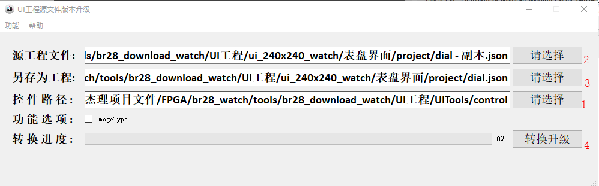
</div>
根据图中序号进行操作：

1. 选择控件模板文件；
> 这里选择刚刚修改的“UI工程/UITools/control/control.json”文件

2. 选择待升级的ui工程源文件；
> br28的UI工程“模式界面”源文件为：“UI工程\ui_240x240_watch\模式界面\project\BT_Watch.json”

3. 选择升级后输出的文件路径及名称；
> 一般将待转换的源文件备份后直接使用源文件命名，升级的源文件使用备份文件。升级完成后即可直接使用升级后的文件。

4. 点击转换升级，等待进度条完成。
> 等待“转换进度”的进度条完成即可。注意br23工程文件升级br28的话，需将“ImageType”选项选中。

至此完成对UI工程源文件的升级，根据模板，升级工具会自动将UI工程源文件中对应控件添加lua属性。此时打开“UI绘图工具”属性栏部分会增加“lua脚本”按钮，点击即弹出lua脚本编辑窗口，UI工具中lua属性添加完成。
<div align=center>
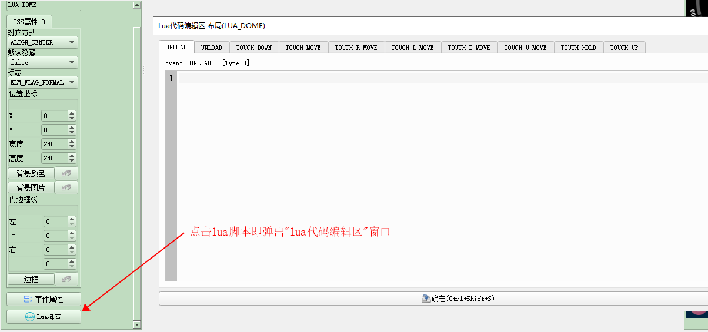
</div>


## 1.2. BR28 SDK的对应控件添加lua属性（以layout为例）

### 1.2.1. lua属性结构定义
在BR28 SDK的UI库的头文件“contol.h”中定义lua结构为：

```c
// lua事件类型
enum luascript_event_type {
    LUA_EVENT_ONLOAD = 0,
    LUA_EVENT_UNLOAD,
    LUA_EVENT_TOUCH_DOWN,
    LUA_EVENT_TOUCH_MOVE,
    LUA_EVENT_TOUCH_R_MOVE,
    LUA_EVENT_TOUCH_L_MOVE,
    LUA_EVENT_TOUCH_D_MOVE,
    LUA_EVENT_TOUCH_U_MOVE,
    LUA_EVENT_TOUCH_HOLD,
    LUA_EVENT_TOUCH_UP,
};

// lua属性结构
struct luascript_code {
    u16 type;
    u16 argc;
    char argv[0];
};

// ui资源结构
struct element_luascript {
    u16 num;
    u16 nop; //FFFF
    struct luascript_code code[0];
};

struct element_luascript_t {
    u16 num;
    u16 nop; //FFFF
    struct luascript_code *code[10];
};

```
其中，**枚举变量“luascript_event_type”定义的lua事件类型与上述控件模板中添加的“luascript属性”对应**，枚举值为luasctipt属性的“type”属性。
### 1.2.2. layout结构添加lua属性
在layout控件的结构体内添加lua属性，注意与UI工具中添加的顺序一致。结构体代码为：

```c
struct layout_info {
    struct ui_ctrl_info_head head;
    struct element_event_action *action;
    // lua属性
    struct element_luascript_t *lua;
    union ui_control_info *ctrl;
};

```
> 注意：action 结构为UI工具中“事件属性”对应的属性，我们在UI工具中控件的 lua 属性添加到事件之后，因此这里的结构要将 lua 结构添加到 action 之后。

在 layout.h 头文件中的 layout 结构添加 lua 属性指针，代码为：

```c
struct layout {
    struct element elm; 	//must be first
    u8 hide: 1;
    u8 inited: 1;
    u8 release: 6;
    // u8 css_num:5;
    // u32 css[2];
    u8 page;
    struct element_luascript_t *lua;
    struct layout *layout;
    const struct layout_info *info;
    const struct element_event_handler *handler;
};

```
在 layout.c 中添加对 lua 代码的获取与调用：
#### 1.2.2.1. 在控件初始化函数添加 lua onload 代码的调用
&nbsp;&nbsp;&nbsp;&nbsp;onload 代码我们放在控件初始化时，即 change 事件的 ON_CHANGE_INIT 中调用，那么我们需要在控件新创建时记录下相关的lua信息，然后再到对于事件中添加 lua 代码读取和执行的内容。
1. 找到控件“初始化”或“创建新控件”函数，layout控件的初始化函数为

```c

int layout_init(struct layout *layout, struct layout_info *__info,
                struct element *parent, bool init);
```
2. 记录 lua 相关信息

```c
    struct layout_info *info = (struct layout_info *)ui_core_load_widget_info(__info, -1);
    layout->info = __info;

    /* 记录控件所在页面和lua代码信息 */
    layout->page = info->head.page;
    layout->lua = info->lua;

```
3. 在控件 onchange 回调中添加 lua onload 和 unload 代码获取和执行

```c
static int layout_onchange(void *_layout, enum element_change_event event, void *arg)
{
    struct layout *layout = (struct layout *)_layout;

    int lua_running = 0; /* lua代码执行标志 */
    struct luascript_code *lua_code = NULL;     /* lua 代码结构 */
    struct element_luascript_t *elm_lua = NULL; /* 控件中 lua 代码属性 */

    if (layout->release) {
        if (event == ON_CHANGE_RELEASE_PROBE) {
            ui_core_release_child_probe(&layout->elm);
            return false;
        }
        if (event == ON_CHANGE_RELEASE) {

            if (ENABLE_LUA_VIRTUAL_MACHINE) {
                /* 在 ON_CHANGE_ERELEASE 事件中执行lua unload代码 */
                elm_lua = (struct element_luascript_t *)ui_core_load_lua(layout->page, layout->lua); /* 从UI资源中读取lua源码 */
                if (luascript_code_find(elm_lua, LUA_EVENT_UNLOAD, &lua_code)) {
                    /* 搜索unload代码并执行 */
                    lua_running = run_lua_string(lua_code->argc, &lua_code->argv);
                }
                ui_core_free_lua(elm_lua); /* 释放lua源码占用的资源 */
            }

            if (layout->handler && layout->handler->onchange) {
                layout->handler->onchange(layout, event, arg);
            }

            ui_core_remove_element(&layout->elm);
            ui_core_free(layout);
            return true;
        }
    }

    if (!layout->inited) {
        return false;
    }

    if (ENABLE_LUA_VIRTUAL_MACHINE) {
        if (event == ON_CHANGE_INIT || event == ON_CHANGE_UPDATE_ITEM) {
            /* 在 ON_CHANGE_INIT 事件中执行onload代码 */
            elm_lua = (struct element_luascript_t *)ui_core_load_lua(layout->page, layout->lua);
            if (luascript_code_find(elm_lua, LUA_EVENT_ONLOAD, &lua_code)) {
                lua_running = run_lua_string(lua_code->argc, &lua_code->argv);
            }
            ui_core_free_lua(elm_lua);
        }
        /* 默认不 return */
        if (lua_running) {
            return true;
        }
    }

    if (layout->handler && layout->handler->onchange) {
        if (layout->handler->onchange(layout, event, arg)) {
            return true;
        }
    }
    switch (event) {
    case ON_CHANGE_HIGHLIGHT:
        layout_highlight(layout, (int)arg);
        break;
    case ON_CHANGE_SHOW_POST:
        custom_draw_callback(layout, arg);
        // 先预留，后续自定义绘图可能要在这里实现
        break;
    default:
        break;
    }

    return true;
}

```

4. 需注意的几个函数接口含义
```c
// 加载lua代码
// 该函数会在指定的UI页资源中加载lua代码并自动申请控件存储，将内存指针返回
elm_lua = (struct element_luascript_t *)br28_load_lua(info->head.page, info->lua);
```

```c
// 搜索lua代码块
// 该函数会在 elm_lua 指针的内存中搜索指定事件“LUA_EVENT_ONLOAD” 的代码，并将其指针赋值给 lua_code，如果成功找到则返回true，否则返回false
luascript_code_find(elm_lua, LUA_EVENT_ONLOAD, &lua_code)
```

```c
// 执行lua代码，其中参数argc为源码字符串长度，参数argv为源码字符串指针
lua_running = run_lua_string(lua_code->argc, &lua_code->argv);
```

```c
// 释放elm_lua内存
ui_core_free_lua(elm_lua);
```

#### 1.2.2.2. 在控件 ontouch 事件回调函数添加 touch 事件的响应代码执行
ontouch事件处理函数如下，根据br28 ui资源的存放机制，在调用该代码之前需要主动加载lua代码，而后再执行。

```c
static int layout_ontouch(void *_layout, struct element_touch_event *e)
{
    struct layout *layout = (struct layout *)_layout;
    int lua_code = 0;
    struct element_luascript_t *elm_lua = NULL;

    if (!layout->inited) {
        return false;
    }

    if (ENABLE_LUA_VIRTUAL_MACHINE) {
        // 加载 lua 源码资源
        elm_lua = (struct element_luascript_t *)ui_core_load_lua(layout->page, layout->lua);
        // 执行 touch 对于事件源码，该函数定义在 control.h 中
        lua_code = lua_touch_event_run(elm_lua, e);
        ui_core_free_lua(elm_lua);
        if (lua_code) {
            return true;
        }
    }

    if (layout->handler && layout->handler->ontouch) {
        if (layout->handler->ontouch(layout, e)) {
            return true;
        }
    }

    return false;
}

```

注意：由于lua回调可能会调用自身资源，因此在执行onload部分代码时，应当先让控件初始化完成再执行onload代码。同样在控件使用release释放自身资源之前执行lua unload部分代码


## 2. 使用lua脚本开发APP
&nbsp;&nbsp;&nbsp;&nbsp;通过章节一已经完成在ui源文件和SDK中添加lua脚本属性，接下来使用新版UI工具运用lua脚本开发APP，同时例用lua模拟器在windows系统下完成预调试。在模拟器运行无误后再将编译的UI资源文件下载到项目的flash中，在小机中完成最终测试。
### 2.1. lua数据类型
&nbsp;&nbsp;&nbsp;&nbsp;lua 是一种无类型的解释语言，其变量无需像C语言一样声明变量类型，在变量初始化时解释器会自动确定该变量的类型。
   |编号|数据类型|描述|
   |:-----:|:-----:|:-----|
   |1|nil|用于区分值与某些数据或没有（nil）数据|
   |2|boolean|包括 true 和 false 作为值，通常用于条件检查|
   |3|number|表示实数（双精度浮点）数字|
   |4|string|表示字符数组|
   |5|function|表示用C或者lua编写的方法（函数）|
   |6|userdata|表示任意C语言数据|
   |7|thread|表示独立的执行线程，它用于实现协同程序|
   |8|table|表示普通数组，符号表，集合，记录，图形，树等，并实现关联数组。它可以保存任何值（除了nil）|
> 注意：
>
> table （table）是 lua 中一种功能强大的数据结构，可以用它创建不同的数据类型，如：数组、字典等
> * Lua table 使用关联型数组，你可以用任意类型的值来作数组的索引，但这个值不能是 nil。
> * Lua table 是不固定大小的，你可以根据自己需要进行扩容。
> * Lua也是通过table来解决模块（module）、包（package）和对象（Object）的。 例如string.format表示使用"format"来索引table string。
> 
> ```lua
> -- 简单的 table
> mytable = {}
> print("mytable 的类型是 ",type(mytable))
> 
> mytable[1]= "Lua"
> mytable["wow"] = "修改前"
> print("mytable 索引为 1 的元素是 ", mytable[1])
> print("mytable 索引为 wow 的元素是 ", mytable["wow"])
> 
> -- alternatetable和mytable的是指同一个 tabl
> alternatetable = mytable
> 
> print("alternatetable 索引为 1 的元素是 ", alternatetable[1])
> print("mytable 索引为 wow 的元素是 ", alternatetable["wow"])
> alternatetable["wow"] = "修改后"
> 
> print("mytable 索引为 wow 的元素是 ", mytable["wow"])
> 
> -- 释放变量
> alternatetable = nil
> print("alternatetable 是 ", alternatetable)
> 
> -- mytable 仍然可以访问
> print("mytable 索引为 wow 的元素是 ", mytable["wow"])
> 
> mytable = nil
> print("mytable 是 ", mytable)
> ```
> 


### 2.2. 常用的lua语法
1. 条件语句
```lua
-- 条件语句
if (布尔表达式0) then
    -- 布尔表达式0为true时执行该语句块
elseif (布尔表达式1) then
    -- 布尔表达式1为true时执行该语句块
else
    -- 布尔表达式0和1均为false时执行该语句块
end
```
2. 循环语句
```lua
-- while 循环语句
while (condition) do
    -- statements
end
-- statements(循环体语句) 可以是一条或多条语句，condition(条件) 可以是任意表达式，在 condition(条件) 为 true 时执行循环体语句。
```

```lua
-- for 循环语句
--[[
Lua 编程语言中 for 语句有两大类：
    1、数值 for 循环
    2、泛型 for 循环
]]

-- 1. 数值 for 循环
for var=exp1,exp2,exp3 do
    <执行体>  
end  
-- var 从 exp1 变化到 exp2，每次变化以 exp3 为步长递增 var，并执行一次 "执行体"。exp3 是可选的，如果不指定，默认为1。且for的三个表达式在循环开始前一次性求值，以后不再进行求值。比如上面的f(x)只会在循环开始前执行一次，其结果用在后面的循环中。
for i=10, 1, -1 do
    print(i)
end


-- 2. 泛型 for 循环
-- 泛型 for 循环通过一个迭代器函数来遍历所有值，类似 java 中的 foreach 语句。
a = {"one", "two", "three"}
for i, v in ipairs(a) do
    -- 整数索引，此时table与数组一样，可通过a[1]来访问 “one”
    print(i, v)
end

b = {name="xiaoming", age=15, class=1}
for k, v in pairs(b) do
    -- 键-值 结构
    print(k, v)
end

```

```lua
repeat
    -- statements
until(condition)
-- 循环条件判断语句（condition）在循环体末尾部分，所以在条件进行判断前循环体都会执行一次。如果条件判断语句（condition）为 false，循环会重新开始执行，直到条件判断语句（condition）为 true 才会停止执行。(类似于C语言的 do...while 循环)
a = 5
repeat
    print(a)
    a = a + 1
until(a>10)
```
3. 循环控制语句
```lua
-- break 语句
-- break 语句插入在循环体中，用于退出当前循环或语句，并开始脚本执行紧接着的语句。如果使用循环嵌套，break语句将停止最内层循环的执行，并开始执行的外层的循环语句。

a = 10
--[ while 循环 --]
while( a < 20 ) do
   print("a 的值为:", a)
   a=a+1
   if( a > 15) then
      --[ 使用 break 语句终止循环 --]
      break
   end
end
```

```lua
-- goto 语句
-- goto 语句允许将控制流程无条件地转到被标记的语句处。
local a = 1
::label:: print("--- goto label ---")

a = a+1
if a < 3 then
    goto label   -- a 小于 3 的时候跳转到标签 label
end
```
4. 函数定义

lua 函数定义格式如下：

    optional_function_scope function function_name( argument1, argument2, argument3..., argumentn)
        function_body
        return result_params_comma_separated
    end
解析：
* optional_function_scope: 该参数是可选的制定函数是全局函数还是局部函数，未设置该参数默认为全局函数，如果你需要设置函数为局部函数需要使用关键字 local。
* function_name: 指定函数名称。
* argument1, argument2, argument3..., argumentn: 函数参数，多个参数以逗号隔开，函数也可以不带参数。
* function_body: 函数体，函数中需要执行的代码语句块。
* result_params_comma_separated: 函数返回值，Lua语言函数可以返回多个值，每个值以逗号隔开。

示例：
```lua
--[ 普通函数：返回两个数的最大值 ]
function max(a, b)
    if (a > b) then
        result = a
    else
        result = b
    end
    return result
end

--[ 函数作为参数：求两数和，并打印最大值 ]
function add(a, b, func)
    result = a + b
    print("the max number is: "..tostring(func(a, b)))
    return result
end
sum = add(2, 5, max)

-- [ 多个返回值：求数组中最大值及其索引 ]
function maximum (a)
    local mi = 1             -- 最大值索引
    local m = a[mi]          -- 最大值
    for i,val in ipairs(a) do
       if val > m then
           mi = i
           m = val
       end
    end
    return m, mi
end
max_num, max_ind = maximum({8, 2, 3, 15, 7, 1})

-- [ 可变参函数：求一组整数的和 ]
function add(...)
    local s = 0

    -- 通过 select("#", ...) 获取可变参数的数量
    print("arg number: "..tostring(select("#", ...)))

    -- {...} 表示一个由所有变长参数构成的数组
    for i, v in ipairs{...} do
        s = s + v
    end
    return s  
end

```

5. 模块和包

Lua 的模块是由变量、函数等已知元素组成的 table，因此创建一个模块很简单，就是创建一个 table，然后把需要导出的常量、函数放入其中，最后返回这个 table 就行。以下为创建自定义模块 module.lua，文件代码格式如下：
```lua
-- 文件名为 module.lua
-- 定义一个名为 module 的模块
module = {}
 
-- 定义一个常量
module.constant = "这是一个常量"
 
-- 定义一个函数
function module.func1()
    io.write("这是一个公有函数！\n")
end
 
local function func2()
    print("这是一个私有函数！")
end
 
function module.func3()
    func2()
end
 
return module
```

### 2.3. br28 lua库

|名称|描述|例如|
|:-----:|:-----|:-----|
|gui|gui 的各种控件接口|控件显示、隐藏、高亮等|
|bt|蓝牙相关控制接口|蓝牙开关、搜索、连接等|
|music|音乐相关控制接口|音乐开关、音量控制等|
|bsp|核心资源接口|gpio、定时器、事件注册等|
|device|传感器控制接口|心率、计步传感器等|

## 3. 扩展lua库
### 3.1 SDK添加lua扩展接口和库代码
&nbsp;&nbsp;&nbsp;&nbsp;lua代码和SDK C代码之间交互通过lua虚拟机的虚拟栈实现，lua虚拟栈与普通栈一样具有先进后出的特点，C代码可以通过索引获取lua栈中的元素。lua栈的索引可以为正数或负数，正数索引“1”永远表示栈底，从栈底到栈顶依次递增。负数索引“-1”永远表示栈顶，从栈顶到栈底依次递减。

<div align=center>
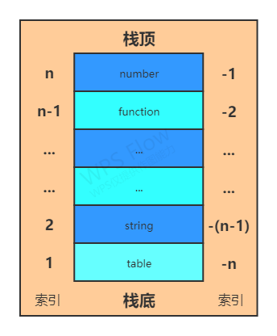
</div>

&nbsp;&nbsp;&nbsp;&nbsp;lua的全局变量存放在一个称为全局变量表的数据结构中，lua的全局表可以想象成一个map哈希表结构，比如lua代码有一个变量：name=”hello world”，全局变量表中存放了name和“hello world”的对应关系，可以通过name在全局中找到对应的“hello world”。

<div align=center>
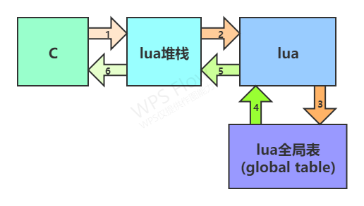
</div>


1. C把name放到堆栈（栈顶），方便lua获取；
2. Lua从堆栈（栈顶）获取到name的值，获取后栈顶变为空；
3. Lua去全局表中查找name对应的字符串；
4. 全局表返回对应的字符串“hello world”；
5. Lua再次把“hello world”放到堆栈（栈顶）；
6. C从堆栈（栈顶）获取name的值“hello world”。

#### 3.1.1 常用的lua CAPI

1. 常用lua虚拟栈数据操作（lua和C交互接口）
   |数据类型|出栈|入栈|类型判断|
   |:-----:|:-----|:-----|:-----|
   |整形|lua_tointer(L, index)|lua_pushinterger(L, num)|lua_isinterger(L, index)|
   |字符串|lua_tostring(L, index)|lua_pushstring(L, num)|lua_isstring(L, index)|
   |布尔值|lua_toboolean(L, index)|lua_pushboolean(L, num)|lua_isboolean(L, index)|
   |浮点数|lua_tounmber(L, index)|lua_pushnumber(L, num)|lua_isnumber(L, index)|

#### 3.1.2 br28 SDK用C语言添加一个lua库
br28 lua库代码在SDK中的路径为：
> apps/watch/ui/lua_ui/

其中核心文件主要有三个，分别为 lua_module.c, lua_module.h, lua_main.lua
* lua_module.c：lua解释器初始化，库加载和lua源码执行接口；
* lua_module.h：各模块声明和lua库全局变量定义;
* lua_main.lua：gui库的核心lua程序，创建gui库，并继承C实现的ui库，同时创建控件实例时负责调用接口加载对于控件类型的方法。

下面以utils库为例，演示实现添加一个lua库的过程

1. 新建文件 lua_utils.c和头文件lua_utils.h。头文件lua_utils.h暂时为空，在 lua_utils.c 文件中添加以下内容：

```c
// lua_utils.h
#ifndef __LUA_UTILS_H__
#define __LUA_UTILS_H__

#endif


// lua_utils.c
#include "lua/lauxlib.h"
#include "lua/lualib.h"

#include "lua_module.h"
#include "lua_utils.h"


static int utils_help(lua_State *L)
{
    printf(">>> lua help!\n");
    return 0;
}


// utils module
const luaL_Reg utils_method[] = {
    {"help", utils_help},

    {NULL, NULL} // 必须以null结尾
};


// 注册utils模块
LUALIB_API int luaopen_utils(lua_State *L)
{
    luaL_newlib(L, utils_method);
    return 1;
}

```

2. 在 lua_module.h 中添加 utils 库注册接口定义

```c
// lua_module.h

// utils模块
#define LUA_UTILSNAME	"utils"
LUALIB_API int (luaopen_utils)(lua_State *L);

```
3. 在 lua_module.c 中的库列表中添加 utils 库的注册
```c
const luaL_Reg loadedlibs[] = {
    // 内部基本库，修改会影响使用
    {"_G", luaopen_base},
    {LUA_STRLIBNAME, luaopen_string},

    // 添加用户自定义库
    {LUA_UTILSNAME,		luaopen_utils },	// utils

    // 必须以NULL结尾
    {NULL, NULL}
};

```
以上，便完成在lua上添加一个utils库，并在库中实现了“help”方法。启动lua解释器后，便可通过命令来调用 help 方法：
> utils:help()


#### 3.1.3 br28 lua库结构
<div align=center>
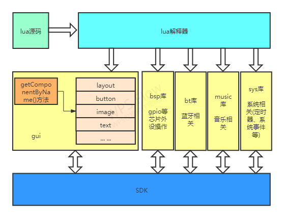
</div>

#### 3.1.4 br28 gui库结构
<div align=center>
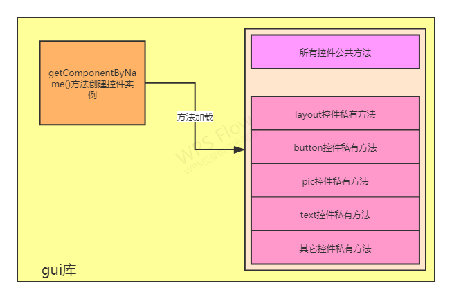
</div>


### 3.2 模拟器添加lua扩展模拟接口
&nbsp;&nbsp;&nbsp;&nbsp;与SDK添加lua库不同，模拟器使用的lua库为通过lua源码将lua模拟器提供的ui控件操作方法进行再封装，封装成与SDK中lua库名称、参数、效果一致的方法，以此来实现模拟器模拟小机上运行效果。

## 4. 使用lua模拟UI效果
&nbsp;&nbsp;&nbsp;&nbsp;下面以button控件高亮和非高亮状态切换为例演示在ui工具中开发APP并使用lua模拟器模拟在br28机器上运行效果的流程。

### 4.1 创建button控件
&nbsp;&nbsp;&nbsp;&nbsp; 在ui工具中新建一个页面，页面中分别添加一个图层，一个布局，在布局内添加一个按钮控件。如下图：
<div align=center>
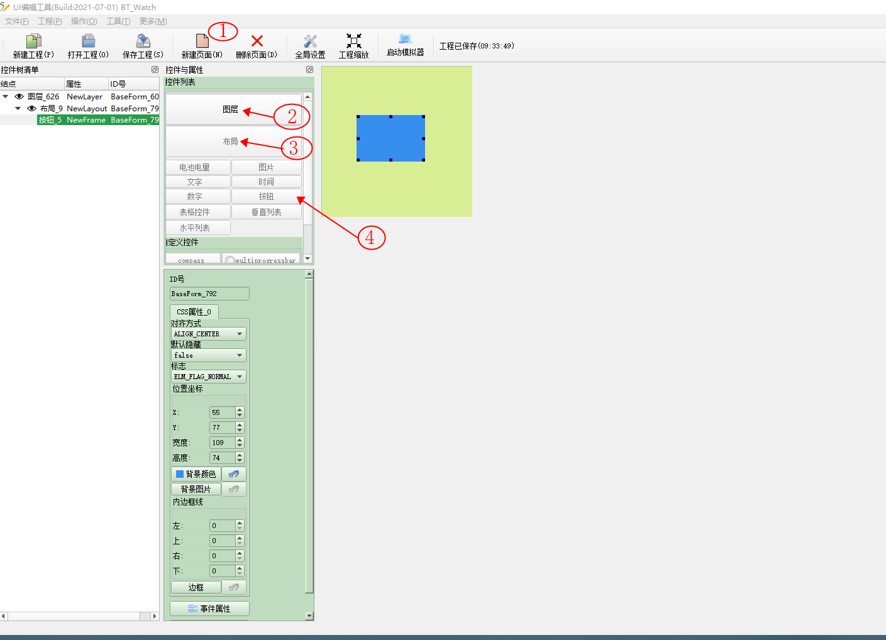
</div>
&nbsp;&nbsp;&nbsp;&nbsp; 创建button高亮属性，这里将高亮时背景颜色设置为黄色
<div align=center>
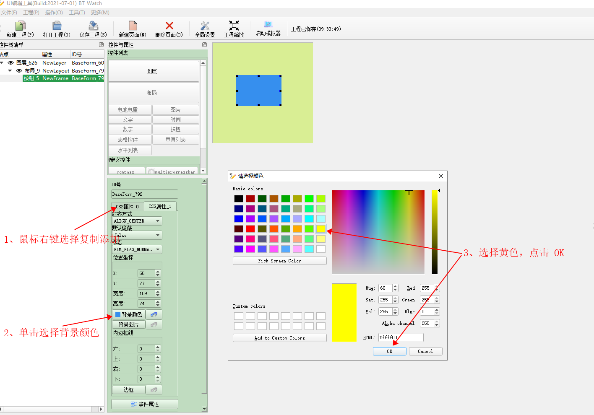
</div>

### 4.2 编辑lua代码
&nbsp;&nbsp;&nbsp;&nbsp; 在属性栏最下端有“lua脚本”按钮，单击它弹出lua脚本编辑窗口。lua脚本按事件类型调用对应代码，根据控件响应的事件种类不同，提供的事件类型选项也不同，例如“数字”控件只有ONLOAD和UNLOAD事件，不响应touch事件。

事件 | 备注
---|---
ONLOAD | 控件加载，控件初始化后会调用这里的脚本，一些控件的全局变量可在这里声明。
UNLOAD | 控件释放，控件的资源释放前会调用该脚本，全局变量等控件自己使用的资源可在这里释放。
TOUCH_DOWN | touch down事件，控件被按下时调用。
TOUCH_MOVE | touch move事件，控件内滑动时（不管方向）调用。
TOUCH_R_MOVE | touch move right事件，控件内右滑时调用。
TOUCH_L_MOVE | touch move left事件，控件内左滑时调用。
TOUCH_D_MOVE | touch move down事件，控件内下滑时调用。
TOUCH_U_MOVE | touch move up事件，控件内上滑时调用。
TOUCH_HOLD | touch hold事件，控件长按时被调用。
TOUCH_UP | touch up事件，控件被松开时调用。

&nbsp;&nbsp;&nbsp;&nbsp; 这里只演示按钮的高亮和非高亮状态切换，在lua脚本编辑窗口的onload和touch_up事件选项内分别添加如下代码：
1. 在ONLOAD事件中声明highlight标志变量

```lua
-- ONLOAD event
print('button onload')
highlight = false
```

2. 在TOUCH_UP中添加高亮切换逻辑
```lua
button = gui:getComponentByName('BaseForm_792')

if (highlight) then
	button:noHighLight()
	highlight = false
else
	button:highLight()
	highlight = true
end

print('button highlight state: '..tostring(highlight))

button = nil
```
3. 完成后点击“确定”保存lua脚本
<div align=center>
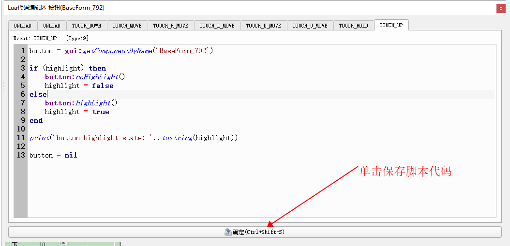
</div>

### 4.3 启动模拟器
保存工程后打开模拟器，即可对以上添加的脚本响应进行仿真模拟，测试是否达到所需的效果。
1. 打开模拟器
<div align=center>
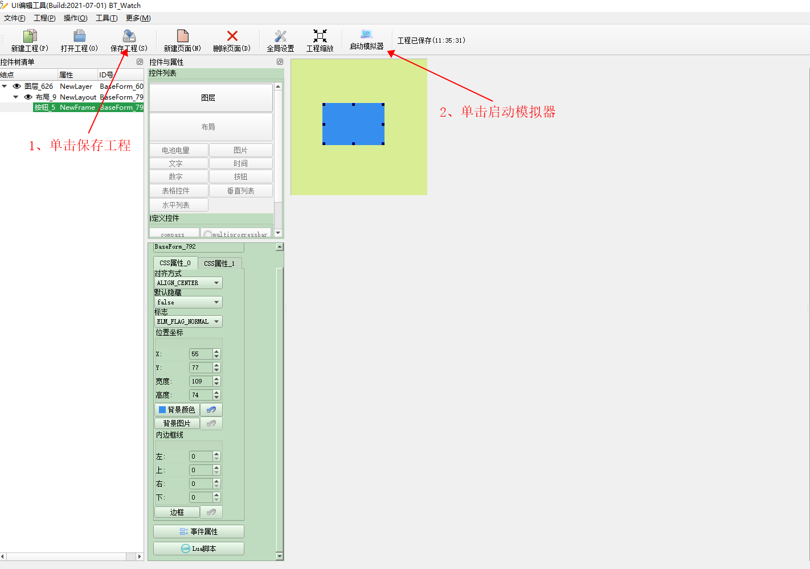
</div>
1. 在工程目录下双击选择工程源文件，并启动模拟器
<div align=center>
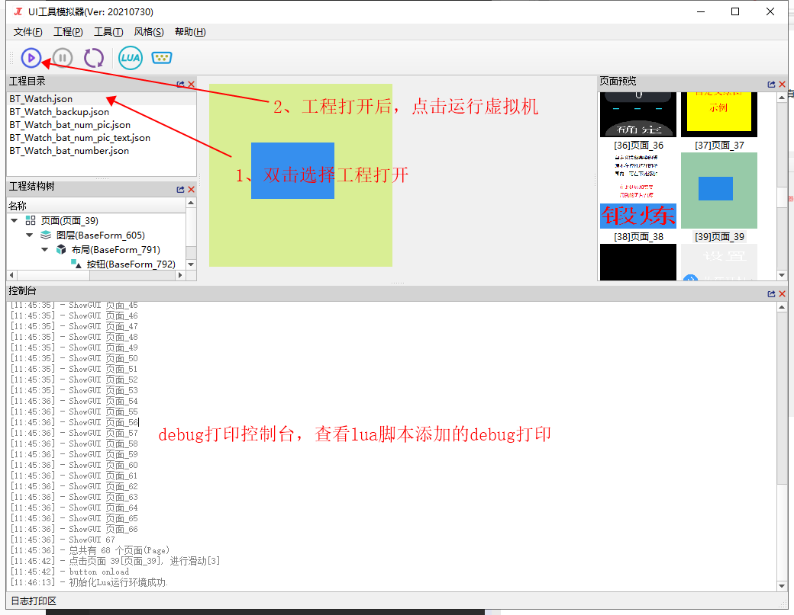
</div>
1. 运行后弹出模拟器窗口，在模拟器窗口中可模拟ui在小机中的动作及响应。若响应效果不如预期，则根据控制台打印debug。
<div align=center>
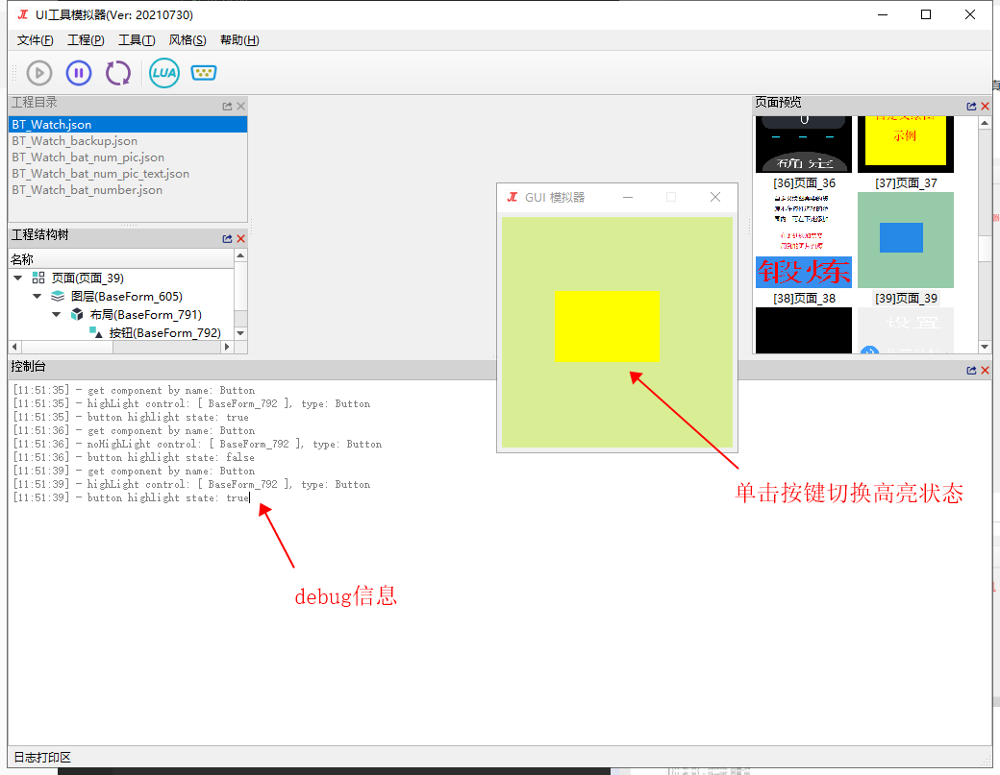
</div>
注意：需特别留意 [ ERROR ] 的打印，系统将参数检查等内容在做在虚拟机中，如果参数类型错误等会打印相应的 [ ERROR ] 信息。小机运行时不检查参数类型，因此如果参数类型错误等会导致小机获取到的参数为空，从而不能正常运行出结果。

### 4.4 小机运行验证
通过4.3在lua模拟器中验证完成所需功能后，将UI资源保存编译，然后下载到小机上进行最终验证。
1. 打开UI资源生成工具，一般目录为：
> UI工程\ui_240x240_watch\模式界面\step2-打开UI资源生成工具.bat
2. 点击“生成资源文件”，将UI源文件编译成UI资源；
3. 通过tools目录下的“download.bat”脚本将资源文件下载到小机；
4. 运行验证。

## 5 现有的lua接口
所有ui控件相关操作均通过 gui:getComponentByName("BUTTON_1") 这种方法获取，其中参数为UI工具中控件的唯一名称“ID号”；获取实例后系统会自动根据不同的控件类型加载对应控件的方法。其中公共方法所有控件均可使用，Text 方法只可用于文本控件，image 方法只可用于图片控件等。如果图片控件调用文本控件的方法，则系统会提示调用nil值。
### 5.1 GUI 库

#### 5.1.1 函数接口介绍模板
1. 名称：
2. 功能：
3. 参数：
   1. 无
4. 返回值：
   1. 无
5. 异常情况：
   1. 
6. 示例：
```lua
```

#### 5.1.1 获取控件对象
1. 名称：obj = gui:getComponentByName(ename)
2. 功能：通过控件名称创建该控件的对象
3. 参数：
   1. ename 编辑器中控件的名称
4. 返回值：
   1. obj 控件对象
5. 异常情况：
   1. 控件类型未知时，返回值obj为空
6. 示例：
```lua
-- 文本控件名称 TEST_TEXT，获取该文本控件对象，并设置该文本控件显示"hello"
test_text = gui:getComponentByName("TEST_TEXT")
test_text:setText("hello")
```

#### 5.1.2 页面切换
1. 名称：gui:switchPageByName(ename, mode, record)
2. 功能：以指定方式跳转到指定页面，并选择是否记录跳转路径
3. 参数：
   1. ename: 目标页面名称
      1. "PAGE_x" 第x页的页面名称
   2. mode：切换方式，
      1. "left" 目标页面从左边滑入
      2. "right" 目标页面从右边滑入
      3. "hide" 直接刷入目标页面，无切换效果
   3. record: 跳转记录标记
      1. true 记录跳转路径
      2. false 不记录跳转路径
4. 返回值：
   1. 无
5. 异常时：
   1. 跳转记录最多8层，如果跳转路径记录已满，则清除最前面的记录，后面继续追加当前记录。这将导致过多层级跳转后不能回到最开始记录的页面。
6. 示例：
```lua
-- 从当前页跳转到 PAGE_1，左边滑入，记录路径，PAGE_1中可用backToPreviousPage方法回到当前页面
gui:switchPageByName("PAGE_1", "left")

-- 从当前页跳转到 PAGE_3，直接刷入目标页，不记录路径
gui:switchPageByName("PAGE_3", "hide", false)
```

#### 5.1.3 返回上一页
1. 名称：gui:backToPreviousPage(mode)
2. 功能：返回记录中的上一层页面
3. 参数：
   1. mode 切换模式
      1. "left" 上一层页面从左边滑入
      2. "right" 上一层页面从右边滑入
      3. "hide" 直接刷入上一层页面，无切换效果
4. 返回值：
   1. 无
5. 异常情况：
   1. 无上一层页面可返回时，返回滑动列表中的第一个页面
6. 示例：
```lua
-- 返回上一层页面，上一层页面从右边滑入
gui:backToPreviousPage("right")
```

#### 5.1.4 检查上一层页面
1. 名称：bool = gui:checkPreViousPage(ename)
2. 功能：检查页面跳转记录中的上一个页面是否为指定页面
3. 参数：
   1. ename 页面的名称“PAGE_x”
4. 返回值：
   1. bool 是否为指定页面
      1. true 是指定页面
      2. false 不是指定页面
5. 异常情况：
   1. 无
6. 示例：
```lua
-- 如果上一个页面是PAGE_3，则跳转到PAGE_5，否则跳转到PAGE_7
if (gui:checkPreviousPage("PAGE_3")) then
    gui:switchPageByName("PAGE_5", "hide")
else
    gui:switchPageByName("PAGE_7", "hide")
end
```
